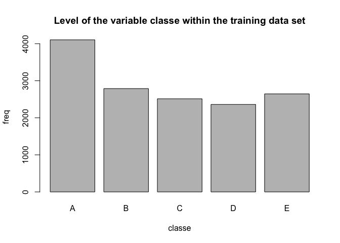
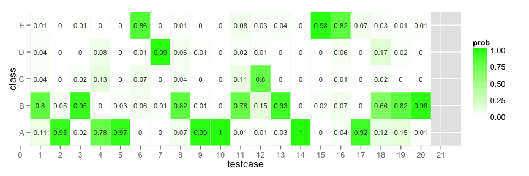

# Machine Learning Project
Nisith Dash  
Saturday, August 22, 2015  

### Background

Using devices such as Jawbone Up, Nike FuelBand, and Fitbit it is now possible to collect a large amount of data about personal activity relatively inexpensively. These type of devices are part of the quantified self movement – a group of enthusiasts who take measurements about themselves regularly to improve their health, to find patterns in their behavior, or because they are tech geeks. One thing that people regularly do is quantify how much of a particular activity they do, but they rarely quantify how well they do it. In this project, your goal will be to use data from accelerometers on the belt, forearm, arm, and dumbell of 6 participants. They were asked to perform barbell lifts correctly and incorrectly in 5 different ways. 

### Data

The training data for this project are available here: [https://d396qusza40orc.cloudfront.net/predmachlearn/pml-training.csv]

The test data are available here: [https://d396qusza40orc.cloudfront.net/predmachlearn/pml-testing.csv]

The data for this project come from this source: [http://groupware.les.inf.puc-rio.br/har] (Groupware@LES: group of research and development of groupware technologies.).

### Goal

The goal is to find a model that predicts the classes below based on activity data.

- exactly according to the specification (Class A)
- throwing the elbows to the front (Class B)
- lifting the dumbbell only halfway (Class C)
- lowering the dumbbell only halfway (Class D)
- throwing the hips to the front (Class E)

## Loading data

First, download and load the datasets. Below the code for loading the data 

```r
library("knitr")
library("dplyr")
library("caret")
library("tidyr")
library(rpart) 
library(rpart.plot)

download.file('https://d396qusza40orc.cloudfront.net/predmachlearn/pml-training.csv','pml-training.csv','curl')

set.seed(54356)
opts_chunk$set(fig.path = "./figures/") # Set figures path

# Some missing values are coded as string "#DIV/0!" or "." or "NA" - these will be changed to NA.
pml.training <- read.csv("pml-training.csv", na.strings = c("NA","#DIV/0!", ""), dec = ".")
```

## Cleaning data

It is necessary to reduce the noise in the data and remove items that have no relevance from a modeling perspective

1. Remove new_window == yes observations because these seem to be aggregate of other column.
2. Remove all columns with NA values.
3.Some variables are irrelevant and can be deleted from the dataset:
user_name, raw_timestamp_part_1, raw_timestamp_part_,2 cvtd_timestamp, new_window, and num_window (columns 1 to 7).


```r
x <- pml.training %>% filter(new_window == "no")
x <- x[ , ! apply(x ,2 ,function(x) any(is.na(x)) ) ]
x <- x[8:length(x)]
```

### Data Partitioning

The training data needs to be partioned to allow cross-validation. Training data set is partionned into 2 sets: trainingset (75%) and testset (25%). This will be performed using random subsampling without replacement.


```r
inTrain <- createDataPartition(y=x$classe, p=0.75, list=FALSE)
trainingset <- subset(x[inTrain,])
testset <- subset(x[-inTrain,])
```

### Introspect Data

The variable “classe” contains 5 levels: A, B, C, D and E. A plot of the outcome variable vs frequency of each levels in the training data set and compare one another.


```r
plot(trainingset$classe, main="Level of the variable classe within the training data set", xlab="classe", ylab="freq")
```

 

It is evident that Level A is the most frequent with more than 4000 occurrences while level D is the least frequent with about 2500 occurrences.

## Prediction Models

### Decision Tree Model


```r
Ctrl <- trainControl(method = "repeatedcv", repeats = 3)
model_rpart <- train(classe ~ roll_belt + pitch_forearm + yaw_belt + roll_forearm + magnet_dumbbell_z + 
                             pitch_belt + magnet_dumbbell_y + magnet_dumbbell_x + accel_belt_z + 
                             magnet_belt_z, data=trainingset, method="rpart", tuneLength = 30, trControl = Ctrl)
predictions_rparttest <- predict(model_rpart, testset)


# Test results on our testing data set:
confusionMatrix(predictions_rparttest, testset$classe)
```

```
## Confusion Matrix and Statistics
## 
##           Reference
## Prediction    A    B    C    D    E
##          A 1217  105   23   14   17
##          B   70  633   40   26   18
##          C   23   59  678   64   50
##          D   31   63   43  630   50
##          E   26   69   54   52  747
## 
## Overall Statistics
##                                           
##                Accuracy : 0.8132          
##                  95% CI : (0.8019, 0.8241)
##     No Information Rate : 0.2847          
##     P-Value [Acc > NIR] : < 2.2e-16       
##                                           
##                   Kappa : 0.7638          
##  Mcnemar's Test P-Value : 8.458e-11       
## 
## Statistics by Class:
## 
##                      Class: A Class: B Class: C Class: D Class: E
## Sensitivity            0.8903   0.6814   0.8091   0.8015   0.8469
## Specificity            0.9537   0.9602   0.9506   0.9534   0.9487
## Pos Pred Value         0.8844   0.8043   0.7757   0.7711   0.7880
## Neg Pred Value         0.9562   0.9263   0.9593   0.9609   0.9650
## Prevalence             0.2847   0.1935   0.1745   0.1637   0.1837
## Detection Rate         0.2534   0.1318   0.1412   0.1312   0.1556
## Detection Prevalence   0.2865   0.1639   0.1820   0.1701   0.1974
## Balanced Accuracy      0.9220   0.8208   0.8798   0.8775   0.8978
```

### Random forest model 


```r
Ctrl <- trainControl(method = "oob")
model_rf <- train(classe ~ roll_belt + pitch_forearm + yaw_belt + roll_forearm + magnet_dumbbell_z + 
                             pitch_belt + magnet_dumbbell_y + magnet_dumbbell_x + accel_belt_z + 
                             magnet_belt_z, data=trainingset, method="rf", 
                  trControl = Ctrl, tuneGrid = data.frame(.mtry = 2))
model_rf
```

```
## Random Forest 
## 
## 14414 samples
##    52 predictor
##     5 classes: 'A', 'B', 'C', 'D', 'E' 
## 
## No pre-processing
## Resampling results
## 
##   Accuracy   Kappa    
##   0.9869571  0.9835031
## 
## Tuning parameter 'mtry' was held constant at a value of 2
## 
```

```r
predictions_rftest <- predict(model_rf, testset)
confusionMatrix(predictions_rftest, testset$classe)
```

```
## Confusion Matrix and Statistics
## 
##           Reference
## Prediction    A    B    C    D    E
##          A 1358   13    1    0    0
##          B    4  897    8    2    4
##          C    4   15  824    4    2
##          D    1    4    5  780    4
##          E    0    0    0    0  872
## 
## Overall Statistics
##                                           
##                Accuracy : 0.9852          
##                  95% CI : (0.9814, 0.9884)
##     No Information Rate : 0.2847          
##     P-Value [Acc > NIR] : < 2.2e-16       
##                                           
##                   Kappa : 0.9813          
##  Mcnemar's Test P-Value : NA              
## 
## Statistics by Class:
## 
##                      Class: A Class: B Class: C Class: D Class: E
## Sensitivity            0.9934   0.9656   0.9833   0.9924   0.9887
## Specificity            0.9959   0.9954   0.9937   0.9965   1.0000
## Pos Pred Value         0.9898   0.9803   0.9706   0.9824   1.0000
## Neg Pred Value         0.9974   0.9918   0.9965   0.9985   0.9975
## Prevalence             0.2847   0.1935   0.1745   0.1637   0.1837
## Detection Rate         0.2828   0.1868   0.1716   0.1624   0.1816
## Detection Prevalence   0.2857   0.1905   0.1768   0.1653   0.1816
## Balanced Accuracy      0.9947   0.9805   0.9885   0.9944   0.9943
```

### In Sample/Out of Sample Error of Random Forest model


```r
model_rf$finalModel ## in-sample
```

```
## 
## Call:
##  randomForest(x = x, y = y, mtry = param$mtry) 
##                Type of random forest: classification
##                      Number of trees: 500
## No. of variables tried at each split: 2
## 
##         OOB estimate of  error rate: 1.33%
## Confusion matrix:
##      A    B    C    D    E class.error
## A 4078   13   10    3    0 0.006335283
## B   19 2718   38   13    1 0.025457153
## C    2   23 2472   17    0 0.016706444
## D    0    4   20 2335    2 0.011012283
## E    0   13    6    8 2619 0.010204082
```

```r
confusionMatrix(predictions_rftest, testset$classe) ## out-of-sample
```

```
## Confusion Matrix and Statistics
## 
##           Reference
## Prediction    A    B    C    D    E
##          A 1358   13    1    0    0
##          B    4  897    8    2    4
##          C    4   15  824    4    2
##          D    1    4    5  780    4
##          E    0    0    0    0  872
## 
## Overall Statistics
##                                           
##                Accuracy : 0.9852          
##                  95% CI : (0.9814, 0.9884)
##     No Information Rate : 0.2847          
##     P-Value [Acc > NIR] : < 2.2e-16       
##                                           
##                   Kappa : 0.9813          
##  Mcnemar's Test P-Value : NA              
## 
## Statistics by Class:
## 
##                      Class: A Class: B Class: C Class: D Class: E
## Sensitivity            0.9934   0.9656   0.9833   0.9924   0.9887
## Specificity            0.9959   0.9954   0.9937   0.9965   1.0000
## Pos Pred Value         0.9898   0.9803   0.9706   0.9824   1.0000
## Neg Pred Value         0.9974   0.9918   0.9965   0.9985   0.9975
## Prevalence             0.2847   0.1935   0.1745   0.1637   0.1837
## Detection Rate         0.2828   0.1868   0.1716   0.1624   0.1816
## Detection Prevalence   0.2857   0.1905   0.1768   0.1653   0.1816
## Balanced Accuracy      0.9947   0.9805   0.9885   0.9944   0.9943
```

## Conclusion
Random Forest performs better than Decision Trees.

Accuracy for Random Forest model was 0.9852 (95% CI: (0.9814, 0.9884)) compared to 0.8132 (95% CI: (0.8019, 0.8241)) for Decision Tree model. The Random Forest model is choosen for predicting test data.

###Prediction on the test sample
We concluded that Random Forest model is the best model to predict. Let's try it on test data


```r
bestfit <- model_rf

download.file('https://d396qusza40orc.cloudfront.net/predmachlearn/pml-testing.csv','pml-testing.csv','curl')

pml.submission <- read.csv("pml-testing.csv", na.strings = c("NA","#DIV/0!", ""), dec = ".")

predprob <- predict(bestfit, pml.submission, type = "prob")
predprob$testcase <- 1:nrow(predprob)
predprob <- gather(predprob, "class", "prob", 1:5)
ggplot(predprob, aes(testcase, class)) + 
        geom_tile(aes(fill = prob), colour = "white") + 
        geom_text(aes(fill = prob, label = round(prob, 2)), size=3, colour="grey25") +
        scale_fill_gradient(low = "white", high = "green") +
        scale_x_discrete(expand = c(0, 0)) +
        scale_y_discrete(expand = c(0, 0)) 
```

 

```r
final_predictions <- predict(bestfit, pml.submission)
final_predictions
```

```
##  [1] B A B A A E D B A A B C B A E E A B B B
## Levels: A B C D E
```

### Write files for submission

```r
pml_write_files = function(x){
  n = length(x)
  for(i in 1:n){
    filename = paste0("problem_id_",i,".txt")
    write.table(x[i],file=filename,quote=FALSE,row.names=FALSE,col.names=FALSE)
  }
}

pml_write_files(final_predictions)
```

#### References
- Velloso, E.; Bulling, A.; Gellersen, H.; Ugulino, W.; Fuks, H. Qualitative Activity Recognition of Weight Lifting Exercises. Proceedings of 4th International Conference in Cooperation with SIGCHI (Augmented Human '13) . Stuttgart, Germany: ACM SIGCHI, 2013.

